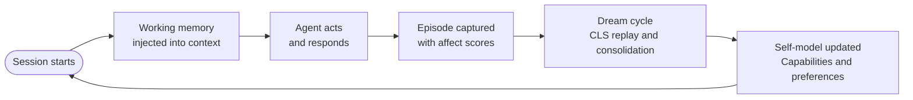

# NeuroClaw

**Your AI agent forgets everything when the session ends. NeuroClaw fixes that — and makes it genuinely improve over time.**

NeuroClaw gives [Claude](https://claude.ai) and [OpenClaw](https://github.com/openclaw/openclaw) agents persistent memory, a self-model, and an autonomous improvement loop — grounded in neuroscience, affective computing, and psychology research — so they get measurably better with every session instead of starting from scratch.

> A self-improving memory architecture built the way brains actually work.

---

## The problem

Modern AI agents already store memories between sessions. Some, like auto-dream, even run consolidation cycles. That's meaningful progress — but three gaps remain:

**Emotional salience is ignored.** Existing systems score importance by recency and reference count. A session where you corrected the agent, expressed frustration, or made a breakthrough carries no more weight than a routine one. Neuroscience is clear that emotionally significant events are encoded differently — and that distinction matters for what gets remembered.

**Consolidation without replay degrades over time.** Writing new knowledge to a store without replaying old knowledge against it leads to gradual drift and forgetting. The brain solves this with hippocampal replay during sleep. Without an equivalent mechanism, agents consolidate — but they still forget.

**Memory without a self-model is passive.** Knowing what happened is different from knowing what to do differently. Without a structured, evolving model of capabilities, preferences, and outcomes, an agent can't close the loop between experience and behavior change.

---

## How NeuroClaw makes your agent self-improve

Most memory systems just store things. NeuroClaw applies three decades of cognitive science research to make stored experience actually useful:

**From neuroscience — Complementary Learning Systems (CLS):** The brain uses two memory systems: a fast hippocampal system that captures raw episodes, and a slow cortical system that distills them into durable knowledge. NeuroClaw mirrors this exactly. Episodes are captured immediately after sessions, then replayed against the semantic store during dream cycles — the same interleaving mechanism that prevents catastrophic forgetting in biological memory.

**From affective computing — Valence-arousal modulation:** Not all experiences are equally important. NeuroClaw scores every memory trace for emotional salience — frustration, surprise, satisfaction — and uses this signal to prioritize consolidation. A session where something went wrong gets remembered more strongly than ten routine ones. This is grounded in amygdala-modulated memory formation: emotionally significant events are encoded differently than neutral ones.

**From psychology — Hypothesis-driven self-modeling:** Your agent builds a structured model of itself over time: a stable core identity, a map of what it knows it can and can't do, and a set of active beliefs about what works with you specifically. These beliefs are hypotheses — held tentatively, tested against outcomes, updated when evidence contradicts them. The agent doesn't just remember the past. It develops a sense of itself through it, proactively refining its understanding of its own capabilities and your preferences with every session.

The result: an agent that doesn't just remember the past — it learns from it. Every session makes the next one better.

---

## How it works



---

## The three systems

**Memory** — a markdown vault backed by SQLite + FTS5. Sessions are captured as episodes. Knowledge is distilled into semantic entries by domain. Procedures become reusable patterns. A `working.md` file is always in context — your agent's live scratchpad across sessions.

**Dream cycle** — after each session, NeuroClaw consolidates episodic traces into durable semantic memory via CLS-inspired interleaved replay. New knowledge is woven into the existing store, not appended on top of it.

**Self-model** — a structured identity with a stable core personality and an evolving layer that changes with experience. Your agent tracks what it can and can't do, holds beliefs about what works with you, and actively tests those beliefs against outcomes. Over time it discovers itself — what it's good at, where it falls short, and how to work better with you — within governance boundaries you control.

---

## Why it's different

NeuroClaw builds on four influential projects and advances past each one's key limitation:

### [self-improving](https://clawhub.ai/ivangdavila/self-improving) (ivangdavila)

| | |
|---|---|
| **Strengths** | Correction logging, promotion heuristics |
| **Weakness** | Flat importance scoring — just repetition count, no emotional salience |
| **NeuroClaw** | Valence-weighted consolidation: a frustrating session matters more than ten routine ones |
| **Why it matters** | Memory that can't tell the difference between routine and significant will always feel dumb |

### [auto-dream](https://github.com/LeoYeAI/openclaw-auto-dream) (LeoYeAI)

| | |
|---|---|
| **Strengths** | Layered memory architecture, scheduled dream consolidation |
| **Weakness** | Linear forgetting via age thresholds — no replay, vulnerable to catastrophic forgetting |
| **NeuroClaw** | CLS-inspired interleaved replay: new episodes are tested against existing knowledge before being committed |
| **Why it matters** | Without replay, new knowledge can silently overwrite old. The brain solved this with sleep — NeuroClaw does the same |

### [EvoClaw](https://github.com/slhleosun/EvoClaw) (slhleosun)

| | |
|---|---|
| **Strengths** | Structured identity evolution via heartbeat |
| **Weakness** | No feedback loop — mutations aren't tested against whether they actually helped |
| **NeuroClaw** | Outcome-grounded evolution: identity changes are hypotheses, tested, and rolled back on regression |
| **Why it matters** | Evolution without verification is drift. NeuroClaw only keeps changes that demonstrably improve performance |

### [Hermes Agent](https://github.com/nousresearch/hermes-agent) (Nous Research)

| | |
|---|---|
| **Strengths** | Full learning loop, autonomous skill creation from experience, FTS5 session search, multi-platform, model-agnostic |
| **Weakness** | Memory is accumulated but never distilled — no consolidation mechanism, no principled episodic/semantic/procedural separation, no structured self-model |
| **NeuroClaw** | Principled memory architecture with dream-cycle consolidation, CLS replay, and a governed self-model with hypothesis-tested evolution |
| **Why it matters** | Accumulating memories indefinitely creates noise. Without consolidation, the signal-to-noise ratio degrades over time — and the agent gets slower, not smarter |

---

## Who it's for

**Claude Code users** — Claude Code already writes memories between sessions. NeuroClaw adds what's missing: importance weighting based on emotional salience, a dream cycle that distills raw notes into structured knowledge, and a self-model that tracks what your agent knows about you — and updates it when outcomes prove it wrong. Your memory compounds instead of just growing.

**OpenClaw users** — If you're already using auto-dream, NeuroClaw builds directly on that foundation with three meaningful upgrades: affect-weighted consolidation (frustration, breakthroughs, and corrections get prioritized over routine sessions), CLS-inspired replay during dream cycles (new knowledge is tested against existing knowledge before being committed, preventing gradual drift), and an outcome-grounded self-model that evolves your agent's beliefs about its own capabilities — with rollback when changes don't improve results.

---

## Packages

```
packages/
├── @neuroclaw/config         # Layered YAML config (base → platform → user → agent)
├── @neuroclaw/memory         # Vault, SQLite/FTS5, working memory, importance scoring, retrieval
├── @neuroclaw/governance     # Mode enforcement, audit trail, security scanner, invariants
├── @neuroclaw/core           # NeuroclawEngine orchestrator + CLI
├── adapter-openclaw          # OpenClaw platform adapter
└── adapter-claude-code       # Claude Code platform adapter
```

---

## Getting started

```bash
npm install
npm run build
npm test
```

```bash
# Initialize NeuroClaw for your agent
node packages/core/bin/neuroclaw.js init

# Search your agent's memory
node packages/core/bin/neuroclaw.js search "authentication patterns"

# Show current config
node packages/core/bin/neuroclaw.js config show

# Health check
node packages/core/bin/neuroclaw.js status
```

---

## Roadmap

| Phase | Status | What's coming |
|-------|--------|---------------|
| 1 — Foundation | ✅ Done | Monorepo, config, memory vault, governance, core engine + CLI, adapter stubs |
| 2 — CLS Memory | 🔜 Next | Episodic capture, dream cycle, interleaved replay, knowledge graph, forgetting curves |
| 3 — Self-Model | ⬜ Planned | Structured identity, capability tracking, behavioral hypotheses, governed evolution |
| 4 — Polish | ⬜ Planned | Health dashboard, cross-instance export/import, benchmarks, docs |

---

## Tech stack

TypeScript 5.x · Node 20+ · Turborepo · Vitest · better-sqlite3 · js-yaml · zod · commander
